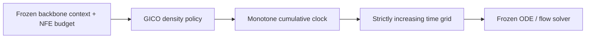

# GenODE Inference

## 30-second entry point

**Problem.** A uniform time grid can spend a small solver budget in the wrong
parts of a frozen generative trajectory.

**Method.** GICO learns a context- and budget-conditioned density over
integration time, integrates that density into a monotone clock, and inverts it
to obtain a strictly increasing solver grid. The generative backbone remains
frozen.



**Code-only publication.** Version 0.5.0 provides reference clocks,
teacher/student training, strict artifact validation, locked-test reporting,
and deterministic release archives. Trained weights, experiment results,
checkpoints, and cluster configuration are intentionally not distributed.

```bash
python -m pip install -e ".[test]"
genode-run-full-pipeline --scenario_key traffic_hourly --dry_run
python -m pytest -q
```

GenODE learns **GICO** (Generative Inference Clock Optimization) policies for
frozen flow-matching and ODE backbones. GICO predicts a continuous-density
integration clock from the solver budget and the frozen backbone's own context; the
density is inverted into a strictly increasing time grid.

The primary package covers frozen backbones, reference clocks, GICO
teacher/student training, locked-test evaluation, and deterministic release
archives. One-evaluation consistency distillation remains available as a
secondary, opt-in workflow.

## Guarantees

- The image API exposes exactly two student kinds:
  `deterministic_barycenter` and `stochastic_causal_ar`. No legacy stochastic
  policy is exposed as an alias or compatibility mode.
- The default conditional supervision pool contains exactly 23 schedules: 12
  base schedules and the reversals of the 11 nonuniform schedules. Uniform is
  self-reversing.
- Conditional policies use the exact context space of the frozen field.
  CIFAR-10 image backbones are explicitly unconditional and reject labels.
- Checkpoint loaders are strict about schema version, tensor names, shapes,
  dtypes, finite values, solver/NFE semantics, and locked-test exclusion.
- Release ZIPs are byte-deterministic and contain canonical manifests and
  SHA-256 sidecars. Source paths, symlinks, reparse points, traversal, and
  case/Unicode member collisions are rejected.
- Datasets, generated outputs, measured results, trained weights, private
  paths, and third-party image weights are not stored in this repository.

## Installation

GenODE requires Python 3.11 or newer.

```bash
python -m pip install -e .
```

For development or raw medical-data preparation:

```bash
python -m pip install -e ".[test]"
python -m pip install -e ".[medical]"
```

## Default GICO reference clocks

The canonical base order is:

| Family | Active keys |
| --- | --- |
| Uniform | `uniform` |
| AYS SD1.5 | `ays_sd15_native`, `ays_sd15_log_sigma` |
| GITS CIFAR-10 example | `gits_cifar10_native`, `gits_cifar10_log_sigma` |
| OTS linear VP | `ots_vp_linear_native`, `ots_vp_linear_log_sigma` |
| Late-p | `late_p_1p5`, `late_p_2`, `late_p_4`, `late_p_8` |
| FlowTS | `flowts_power_0p03` |

Each nonuniform key also has a `_reversed` counterpart. Extra late-p
supervision is opt-in and must be finite and inside `[1.5, 8]`; both the base
and reversed clocks are added:

```bash
genode-train-gico \
  --rows_csv rows.csv \
  --context_embeddings_npz contexts.npz \
  --out_dir outputs/gico \
  --extra_late_p_values 2.25,3,6
```

AYS and GITS start from their pinned published source nodes. The GenODE NFE
grids are deterministic, coordinate-preserving transfers of those nodes, not
claims that the upstream optimizers were rerun for a GenODE backbone. The AYS
log-sigma terminal uses the pinned SD1.5 scaled-linear scheduler realization
(`1000` steps, `beta_start=0.00085`, `beta_end=0.012`) so the terminal is finite.
OTS uses immutable paired `t_res` and `lambda_res` tables produced by the pinned
official linear-VP implementation with its float32 initialization semantics.
The supported source step counts (used as GenODE macro steps) are exactly
`2,3,4,5,6,7,8,10,12,14,16,20`; other counts are rejected, so runtime SciPy
versions cannot change either coordinate view. The exact raw upstream endpoints
and both vector families are bound by the versioned table identity. FlowTS uses
the released power-clock formula and exponent. Every catalog record is generated
from the runtime registry and includes the exact source model, solver,
coordinate, commit, file, and license:

- [AYS constants in Diffusers](https://github.com/huggingface/diffusers/blob/50e7158093710f9c1b4ea9ff100137a91c9228f3/src/diffusers/schedulers/scheduling_utils.py)
- [Diffusers scaled-linear DDIM realization](https://github.com/huggingface/diffusers/blob/50e7158093710f9c1b4ea9ff100137a91c9228f3/src/diffusers/schedulers/scheduling_ddim.py)
- [GITS CIFAR-10 example](https://github.com/zju-pi/diff-sampler/tree/68d5ce427f261962b89ce3b0ee8f6b29f0577328)
- [OTS in DM-NonUniform](https://github.com/scxue/DM-NonUniform/blob/95d4ac6b8a3d1d389ab63a197e1b05d8512b6a99/step_optim.py)
- [FlowTS/FMTS sampler](https://github.com/UNITES-Lab/FlowTS/blob/1ec35fb1d3d89d91a1607a9f949a515347d54c8c/FMTS/Models/interpretable_diffusion/FMTS.py)

See [THIRD_PARTY_NOTICES.md](THIRD_PARTY_NOTICES.md) for attribution and
license details.

## Conditioning contract

For temporal, conditional-generation, and molecular backbones,
`frozen_backbone_policy_context_v1` is the projected summary actually consumed
by the frozen field:

```text
policy_context = cache.summary
policy_context = concat(cache.summary, cache.cond_emb)  # when auxiliary conditioning exists
```

The backbone must be frozen and in evaluation mode. Exported contexts are
finite, detached, width-checked, and produced without gradients. Raw encoder
summaries are never selectable policy inputs.

For ImageNet-64, GICO uses the frozen RF++/1-RF model's native
`native_model.model.map_label` representation and binds the policy to the
backbone/checkpoint/context identities. Both registered CIFAR-10 backbones are
unconditional; supplying a label is an error.

### Image GICO supervision and students

Both image students consume one validated `ImageGICOSupervision` object. It
binds NFEs 2, 4, and 8 to the fixed schedule support, alias-aggregated mixture
weights, the corresponding density barycenter, an exact context table, reward
diagnostics, and semantic source identities. Consequently, the students cannot
quietly train against different teacher laws:

| Student kind | Training target | Published default |
| --- | --- | --- |
| `deterministic_barycenter` | Mixture-weighted density barycenter | Conditional model with 256 hidden dimensions |
| `stochastic_causal_ar` | Terminal-weighted complete-path NLL on strict prefix-trie support | 128 model dimensions, 256-token vocabulary, four heads, 192-dimensional FFN, one Transformer block, 16-dimensional NFE embedding (339,184 parameters) |

Conditional ImageNet supervision minimizes KID. Its advantage is
`uniform KID - schedule KID`; jackknife standard errors feed
class-to-feature-group-to-global shrinkage, followed by reward-scale
normalization and clipping to `[-5, 5]`. Density aliases are aggregated before
softmax and their mass is split consistently over duplicate schedules. The
same weights form the deterministic density barycenter.

Authenticated unconditional mixture evidence uses one explicit all-zero
context, which covers CIFAR without inventing class labels. Contexts are never
manufactured, truncated, or remapped: conditional artifacts require their
bound table, while unconditional artifacts require the singleton zero table.

The stochastic student retains 63 actions, 64 density bins, endpoint-aware
cube-companded tokens, and a maximum clock-node quantization drift below
`0.005`. At inference it samples only complete supported prefix-trie paths,
using either caller-supplied uniforms or replayable SHA-256 counter uniforms.
The deterministic student directly materializes its predicted barycenter.
Neither inference path reads reward evidence or invokes the teacher. Both
freeze the complete time grid before Euler integration and account for exactly
the requested number of field evaluations. Student artifacts embed only the
reward-free deployment binding they need (contexts plus support or direct
barycenter), so materialization does not load the supervision evidence.

Strict loaders preserve the active deterministic artifact protocols and the
causal Transformer's state layout. Unsupported legacy stochastic layouts are
rejected instead of converted implicitly.

## Image GICO workflow

`genode-image-gico` is the single image-policy executable:

```bash
genode-image-gico build-targets --manifest inputs/targets.json --output artifacts/supervision
genode-image-gico train-deterministic --supervision artifacts/supervision --output artifacts/deterministic
genode-image-gico train-stochastic --supervision artifacts/supervision --output artifacts/stochastic
genode-image-gico validate --supervision artifacts/supervision \
  --deterministic artifacts/deterministic --stochastic artifacts/stochastic
genode-image-gico materialize --student deterministic_barycenter \
  --artifact artifacts/deterministic \
  --target-nfe 4 --context-indices 0 --output artifacts/schedule
```

`build-targets` accepts a portable JSON manifest. Array paths must be relative
to the manifest, remain inside its directory, and name numeric `.npy` files
loadable with `allow_pickle=False`. A conditional manifest has this shape:

```json
{
  "kind": "conditional_kid",
  "conditional_targets": "conditional-targets.json",
  "fixed_density_mass": "fixed-density-mass.npy",
  "normalized_contexts": "normalized-contexts.npy"
}
```

For authenticated unconditional evidence, use `kind` equal to
`unconditional_mixture` and provide `target_nfes`, `schedule_keys`,
`fixed_density_mass`, `mixture_weights`, and a nonempty `source_identities`
object. The builder creates the required singleton zero context; it does not
accept a synthetic label table.

Training configuration JSON can be supplied with `--config`. Stochastic
materialization requires either an explicit `--uniforms` NumPy array or a
`--request-sha256` plus optional comma-separated `--sample-keys`. Published
directories are additive (existing destinations are rejected), contain
semantic identities and file hashes, and never record absolute input paths.
Use `genode-image-gico <command> --help` for complete arguments.

The same contracts are available from `genode.gico`. The public surface
includes the conditional and unconditional supervision builders, both student
trainers, strict supervision and student artifact loaders, schedule
materialization, counter-uniform derivation, and exact-NFE Euler execution.
`ImageGICOStudentKind` is the type-level source of truth for selecting a
student; downstream code should not use free-form legacy policy names.

## Primary workflow

Run or resume the canonical backbone and schedule pipeline:

```bash
genode-run-full-pipeline --scenario_key traffic_hourly --dry_run
genode-run-schedules --help
```

Preflight support rows, train GICO, and report a frozen student:

```bash
genode-preflight-gico-rows --help
genode-train-gico --help
genode-report-gico-locked-test \
  --gico_student_checkpoint outputs/gico/student.pt \
  --training_summary outputs/gico/training-summary.json \
  --context_rows locked-contexts.csv \
  --context_embeddings_npz contexts.npz \
  --baseline_rows uniform-baseline.csv \
  --out_dir outputs/gico/locked-report
```

Locked-test data are excluded from teacher/student selection. The reporting
command requires explicit baseline rows and emits per-context and aggregate
comparisons.

The verified image runtime registers exactly four external backbones:

- unconditional CIFAR-10 RF++ Config G and EDM VE as 1-RF;
- class-conditional ImageNet-64 RF++ Config E and EDM VE as 1-RF.

Upstream source, dataset, and checkpoint terms apply. Image checkpoints are
user-supplied and are not redistributed by this repository. In particular, the
pinned RF++ registry identifies the network implementation as
`CC-BY-NC-SA-4.0` and records that no separate checkpoint license notice was
found. Review [the third-party notices](THIRD_PARTY_NOTICES.md) before obtaining
or using external image code, datasets, checkpoints, or feature weights.

## Consistency distillation (secondary)

The optional endpoint flow-map workflow is deliberately separate from primary
GICO training:

```bash
genode-collect-flow-map-demonstrations --help
genode-train-flow-map --help
genode-evaluate-flow-map --help
```

Flow-map checkpoints remain cryptographically bound to the frozen backbone and
GICO checkpoint used to create them. Evaluation requires an explicit
measurement protocol and makes no performance claim when its quality gate is
not evaluated.

## Deterministic archives

Build checkpoint-only, named-checkpoint, or frozen policy archives with:

```bash
genode-build-release-archive backbone-manifest --help
genode-build-release-archive named-checkpoints --help
genode-build-release-archive gico-policy --help
genode-build-release-archive validate --archive release.zip
```

The policy archive validates the complete source bundle, then includes the
teacher state, student state, density table, context normalizers, and a fresh
portable GICO manifest. The wrapper records the original manifest digest and
actual training clock pool without carrying obsolete protocol-labelled JSON;
packaging does not imply retraining on the current 23-schedule default.

Each build writes:

- the deterministic ZIP;
- `<archive>.manifest.json`, a canonical external manifest;
- `<archive>.sha256`, the archive digest.

## Development checks

```bash
python -m ruff check .
python -m ruff format --check .
python -m compileall -q src tests
python -m pytest -q
python -m pip check
git diff --check
```

The release matrix covers Python 3.11 and 3.13 with NumPy 1.26 and 2.x, builds
and inspects both the wheel and source distribution, installs the wheel in a
clean environment, and smoke-tests every public CLI.

## License

GenODE is released under the [MIT License](LICENSE). Third-party code,
reference data, external model implementations, datasets, and checkpoint
weights remain subject to their respective terms.
